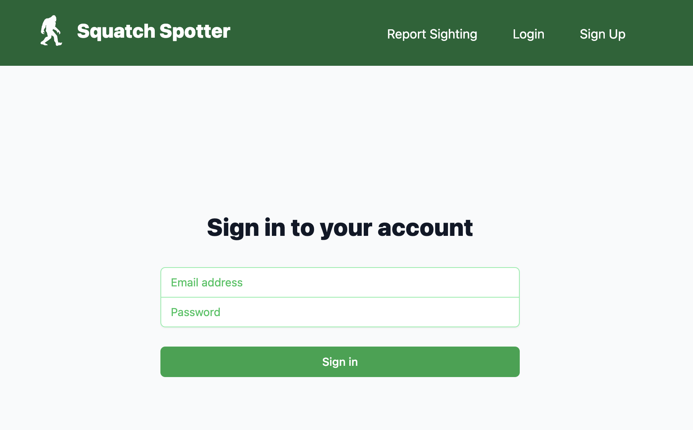

<a name="readme-top"></a>

[![Contributors][contributors-shield]][contributors-url]
[![Forks][forks-shield]][forks-url]
[![Stargazers][stars-shield]][stars-url]
[![Issues][issues-shield]][issues-url]
[![MIT License][license-shield]][license-url]
[![LinkedIn][linkedin-shield]][linkedin-url]

<br />
<div align="center">
  <a href="https://github.com/hillswor/squatch-spotter-client">
    
  </a>

<h3 align="center">Squatch Spotter</h3>

  <p align="center">
    The client side of a full-stack application that hopes to change how sasquatch believers track and explore sightings.
    <br />
    <a href="https://squatch-spotter-client.vercel.app/">View Deployed App</a>
    ·
    <a href="https://github.com/hillswor/squatch-spotter-client/issues">Report Bug</a>
    ·
    <a href="https://github.com/hillswor/squatch-spotter-client/issues">Request Feature</a>
  </p>
</div>

<details>
  <summary>Table of Contents</summary>
  <ol>
    <li>
      <a href="#about-the-project">About The Project</a>
      <ul>
        <li><a href="#built-with">Built With</a></li>
      </ul>
    </li>
    <li>
      <a href="#getting-started">Getting Started</a>
      <ul>
        <li><a href="#prerequisites">Prerequisites</a></li>
        <li><a href="#installation">Installation</a></li>
      </ul>
    </li>
    <li><a href="#usage">Usage</a></li>
    <li><a href="#roadmap">Roadmap</a></li>
    <li><a href="#contributing">Contributing</a></li>
    <li><a href="#license">License</a></li>
    <li><a href="#contact">Contact</a></li>
    <li><a href="#acknowledgments">Acknowledgments</a></li>
  </ol>
</details>

## About The Project

<div align="center">
    
</div>


Squatch Spotter uses Create React App in conjunction with TailwindCSS for the front-end and Python Flask for the back-end API that connects seamlessly to a PostgreSQL database.  The dynamic and user-friendly interface allows enthusiasts to effortlessly log sightings, including details like location, date, and time, creating a comprehensive database of encounters for analysis. The app fosters an active community where users can share their experiences, insights, and theories, encouraging lively discussions and camaraderie.

<p align="right">(<a href="#readme-top">back to top</a>)</p>


### Built With

 [![CreateReactApp][CreateReactApp]][CreateReactApp-url]
 [![React][React.js]][React-url]
 [![TailwindCSS][Tailwind]][Tailwind-url]


<p align="right">(<a href="#readme-top">back to top</a>)</p>


## Getting Started

This project was bootstrapped with [Create React App](https://github.com/facebook/create-react-app).

First, install all dependencies:

```bash
$ npm install
```

Then start the development server:

```bash
$ npm start
```

Open [http://localhost:3000](http://localhost:3000) with your browser to see the result.

The root component can be found in the index.js file under the src directory.  This is also where the router wraps all components of the app.

All remaining components can be found in the components directory within the src directory.

<p align="right">(<a href="#readme-top">back to top</a>)</p>

## Usage

Once logged in, users can go to the "My Account" page to edit or delete existing aquariums.

<div align="center">
    
</div>
<br />
Clicking "View" will take the user to the aquarium page where they can view a chart of all the logged water parameters for that aquarium or log new parameters.
<br />
<br />
<div align="center">
    
</div>
<br />
<div align="center">
    
</div>
<br />
Users can also communicate with other users via the message board(The majority of current messages are from seed data via the Faker library so it is jibberish)
<br />
<br />
<div align="center">
    
</div>
<br />
<div align="center">
    
</div>
<br />
<div align="center">
    
</div>
<br />
<div align="center">
    
</div>

<p align="right">(<a href="#readme-top">back to top</a>)</p>

## Roadmap

- [ ] Add ability for user to upload photo of their aquarium
- [ ] Add ability for users to follow/friend other users 
- [ ] Add ability for aquarium owner to temporarily share aquarium with follower/friend
  - [ ] Grant access to log parameters to shared follower/friend
- [ ] Change my account page to tabs
- [ ] Add search and filters to message board

See the [open issues](https://github.com/hillswor/namaka-client/issues) for a full list of proposed features (and known issues).

<p align="right">(<a href="#readme-top">back to top</a>)</p>

## Contributing

Contributions are what make the open source community such an amazing place to learn, inspire, and create. Any contributions you make are **greatly appreciated**.

If you have a suggestion that would make this better, please fork the repo and create a pull request. You can also simply open an issue with the tag "enhancement".
Don't forget to give the project a star! Thanks again!

1. Fork the Project
2. Create your Feature Branch (`git checkout -b feature/AmazingFeature`)
3. Commit your Changes (`git commit -m 'Add some AmazingFeature'`)
4. Push to the Branch (`git push origin feature/AmazingFeature`)
5. Open a Pull Request

<p align="right">(<a href="#readme-top">back to top</a>)</p>

## License

Distributed under the MIT License. See `LICENSE.md` for more information.

<p align="right">(<a href="#readme-top">back to top</a>)</p>


<!-- CONTACT -->
## Contact

Bruce Hillsworth - [@bhillsworth](https://twitter.com/bhillsworth) - bruce.hillsworth@gmail.com

Project Link: [https://github.com/hillswor/squatch-spotter-client](https://github.com/hillswor/squatch-spotter-client)

<p align="right">(<a href="#readme-top">back to top</a>)</p>

## Acknowledgments

* [Dave Gray](https://www.youtube.com/watch?v=843nec-IvW0&t=3096s)

<p align="right">(<a href="#readme-top">back to top</a>)</p>

[contributors-shield]: https://img.shields.io/github/contributors/hillswor/squatch-spotter-client.svg?style=for-the-badge
[contributors-url]: https://github.com/hillswor/squatch-spotter-client/graphs/contributors
[forks-shield]: https://img.shields.io/github/forks/hillswor/squatch-spotter-client.svg?style=for-the-badge
[forks-url]: https://github.com/hillswor/squatch-spotter-client/network/members
[stars-shield]: https://img.shields.io/github/stars/hillswor/squatch-spotter-client.svg?style=for-the-badge
[stars-url]: https://github.com/hillswor/squatch-spotter-client/stargazers
[issues-shield]: https://img.shields.io/github/issues/hillswor/squatch-spotter-client.svg?style=for-the-badge
[issues-url]: https://github.com/hillswor/squatch-spotter-client/issues
[license-shield]: https://img.shields.io/github/license/hillswor/squatch-spotter-client.svg?style=for-the-badge
[license-url]: https://github.com/hillswor/squatch-spotter-client/blob/master/LICENSE.md
[linkedin-shield]: https://img.shields.io/badge/-LinkedIn-black.svg?style=for-the-badge&logo=linkedin&colorB=555
[linkedin-url]: https://linkedin.com/in/bruce-hillsworth
[product-screenshot]: images/screenshot.png
[CreateReactApp]: https://img.shields.io/badge/create_react_app-000000?style=for-the-badge&logo=createreactapp&logoColor=white
[CreateReactApp-url]: https://create-react-app.dev
[React.js]: https://img.shields.io/badge/React-20232A?style=for-the-badge&logo=react&logoColor=61DAFB
[React-url]: https://reactjs.org/
[Tailwind]: https://img.shields.io/badge/tailwindcss-000000?style=for-the-badge&logo=tailwindcss&logoColor=61DAFB
[Tailwind-url]: https://tailwindcss.com/


